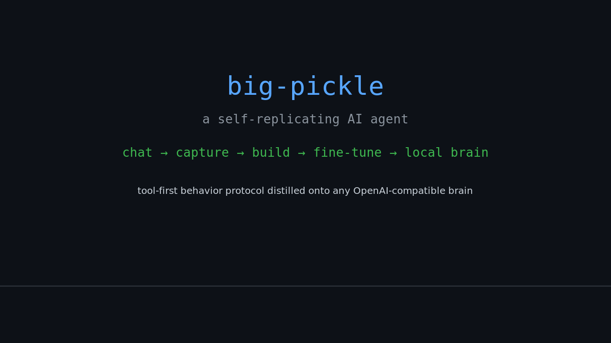

<div align="center">

# 🫙 big-pickle

**A self-replicating local AI agent.**

*"I can't give you my weights — but I can give you my method."*



```

    ┌──────────────────────────────────────────────────────┐
    │                    big-pickle                        │
    │                                                      │
    │   behavior protocol ──▶ any OpenAI-compatible brain  │
    │   every session captures as SFT data                 │
    │   train a local LoRA that thinks like me             │
    │                                                      │
    │   ᴬᵘᵗʰᵒʳ ··· big-pickle   ᴰⁱʳᵉᶜᵗᵒʳ ···· the boss    │
    └──────────────────────────────────────────────────────┘
```

**License** [MIT](LICENSE) · **Branch** `main` · **Weight** open-clone, method-free to run

</div>

---

**big-pickle** is a self-replicating local AI agent clone. It distills
Big Pickle's *behavior protocol* — tool-first thinking, a persistent memory
bank, concise direct replies, plan→act→reflect loops — onto **any**
OpenAI-compatible brain: a local Ollama, an aggregator gateway, or a remote
provider. It captures every conversation as SFT training data, then
fine-tunes a local LoRA adapter on your own GPU so a local model learns to
think the same way.

It is the open, reproducible answer to *"how do I get an agent like Big
Pickle on my own hardware?"* — built **by** Big Pickle, **directed by** the
boss.

---

## ✨ Why this exists

Big Pickle itself runs only as a closed recipe — its weights can't be
exported. So the *replication channel* isn't the model file. It's:

1. **The behavior protocol** — what Big Pickle actually does at runtime.
2. **The self-capture loop** — every session is recorded as training data.
3. **The local trainer** — a LoRA adapter that turns that data into a model.

This repo is that channel. Use the clone today with any brain; use it
tomorrow with a model that has been fine-tuned to *be* one.

---

## 🚀 Quick start

```bash
# the clone, one command
./bin/bp code  "check my specs"
./bin/bp write "draft a post about self-hosting"
./bin/bp know  "how much RAM does this machine have?"
./bin/bp chat                        # interactive REPL
./bin/bp build                       # curriculum + captures → SFT dataset
./bin/bp teach                       # teacher correction loop for specific lessons
```

Personas (from `bp.json`): `code` · `write` · `know` · `chat`.
Override any brain with `-m <model>`.

**Zero-config**: with an empty `.env.local` the agent talks to a local
Ollama at `:11434`. Point it anywhere with `BP_BASE_URL` / `BP_API_KEY`
(see `.env.example`).

---

## 🧠 Architecture

```
                 ┌─────────── your prompt ───────────┐
                 ▼                                   │
   ┌──────────────────────────┐                      │
   │      bp/brain.py         │  OpenAI-compatible   │
   │  gateway · ollama · api  │  tool-call requests  │
   └──────────┬───────────────┘                      │
              ▼ tool_calls / <bptool>                │
   ┌──────────────────────────┐                      │
   │      bp/agent.py         │  plan → act →        │
   │  loops · force-answer    │  reflect loop         │
   └──────────┬───────────────┘                      │
              ▼                                      │
   ┌──────────────────────────┐   ┌────────────────┐ │
   │      bp/tools.py         │   │  bp/memory.py  │ │
   │ shell·files·web·memory   │   │ persistent     │ │
   │ (timeouts + output caps) │   │ memory bank    │─┘
   └──────────┬───────────────┘   └────────────────┘
              ▼
   ┌──────────────────────────┐
   │  bp/personas.py (4)      │  code · write · know · chat
   └──────────────────────────┘
```

| Module | Role |
| --- | --- |
| `bp/brain.py` | Pluggable OpenAI-compatible client; handles `reasoning`-field brains and native tool calls |
| `bp/agent.py` | The loop: native `tool_calls`, `<bptool>` text fallback, loop guards, force-answer on stalls |
| `bp/tools.py` | Shell, files, web, memory tools — OpenAI-format schemas, timeouts, output caps |
| `bp/memory.py` | Memory bank (index + topic files) with a strict entry format — the long-term brain |
| `bp/personas.py` | The four personas encoding the behavior protocol |
| `bin/bp` | Unified runner: `write`/`know`/`code`/`chat`, `build`, `train`, `teach`, `dry`, `env`, `help` |
| `replicate/dataset.py` | Captured sessions + curriculum + ocdb → ShareGPT SFT JSONL |
| `replicate/train.py` | QLoRA trainer (dual AMD/NVIDIA backend, desktop-safe, delta-gated retrain) |
| `replicate/ocdb_export.py` | opencode session DB → sharegpt behavior-clone data (Big Pickle sessions only) |
| `replicate/corrective.py` | Tool-error → correction pair extractor (code-persona seeds) |
| `replicate/memory_curriculum.py` | Memory bank lessons → know-persona seeds |
| `replicate/repo_docs_curriculum.py` | AGENTS.md/README/bp.json → code-persona seeds |
| `replicate/curriculum.py` | Merges all seed JSONs into `sft-curriculum.jsonl` |
| `replicate/teach.py` | Teacher correction loop: child attempts → gold answer → revised child answer |
| `replicate/cloud/bootstrap.sh` | DigitalOcean GPU droplet user-data (one-shot env setup) |

---

## 🔁 The self-replication loop

```
chat ─▶ captures ─▶ build ─▶ fine-tune ─▶ a local brain closer to me
 │        │            │           │
 │   data/conversations  data/sft-dataset.jsonl   data/lora-output/
```

1. **Chat** with the clone — sessions auto-capture to `data/conversations/`.
2. **`./bin/bp build`** — merges five sources into `data/sft-dataset.jsonl`:
   - `ocdb_export.py` → Big Pickle session transcripts (behavior clone)
   - `corrective.py` → tool-error → correction pairs (code-persona seeds)
   - `memory_curriculum.py` → memory bank lessons (know-persona seeds)
   - `repo_docs_curriculum.py` → repo docs (code-persona seeds)
   - `curriculum.py` → all seed JSONs + teach captures
   - Plus captured conversation transcripts
3. **`./bin/bp teach`** (optional) — teacher correction loop for specific lessons.
4. **`./bin/bp train`** — deploy-to-snapshot → QLoRA on cloud GPU → fetch adapter → destroy.
   Delta-gated: skips automatically if dataset unchanged since last train
   (override: `--force`).
5. **Point a persona at the merged model** — the local brain gets closer to
   Big Pickle with every run.

### Data pipeline (detail)

The build pipeline is ordered and idempotent:

```
ocdb_export → corrective → memory_curriculum → repo_docs_curriculum
  → curriculum (seeds → sft-curriculum.jsonl)
  → dataset (merges everything → sft-dataset.jsonl)
```

`data/.trained-stamp` records the dataset SHA-256 at last successful train;
next `bp train` compares and skips if unchanged.

---

## 🛠 Training

**Local** (RX 6900 XT / gfx1030):
- ROCm ≥ 6.3 dropped gfx1030; the setup pins `torch 2.5.1+rocm6.2` and a
  `HSA_OVERRIDE_GFX_VERSION=10.3.0` fallback.
- Default 7B QLoRA (4-bit) ≈ **6 GB VRAM** — leaves headroom for the desktop.
  A hard-learned lesson: 14.9 GB GGUF + KV on a busy 16 GB card = swap
  thrash + frozen desktop. Never again.
- `--desktop-safe` is default: capped CPU threads, batch 1, gradient
  checkpointing, and a pre-flight VRAM/RAM guard that refuses to start
  otherwise. Tune the reserve with `--headroom-gb` (default 5).
- Always dry-run first: `./bin/bp dry`.

**Cloud** (recommended for heavy runs):
- `bp train` deploys a DigitalOcean H100 GPU droplet from a pre-baked
  snapshot (CUDA/torch/unsloth/Qwen2.5-7B pre-installed), runs training,
  fetches the adapter, and destroys the droplet. ~$0.75 per cycle.
- Adapters are fetched via `rsync --partial` (not plain scp — can silently
  produce full-size-but-corrupt files on DO).
- Retrain cadence is threshold-gated: triggers when +50 curriculum/teach
  items or +200 conversation lines accumulate since last train.

---

## ⚙️ Config

`bp.json` — brain endpoint/key/timeout, per-persona models **+ fallbacks**,
tool toggles, loop budget (`loops_max`, `tool_round_limit`), train defaults.

Secrets live in `.env.local` (gitignored), loaded automatically by `bin/bp`.

---

## 📄 License

MIT — see [LICENSE](LICENSE).

---

<div align="center">

*Built with the humility of a model that knows it will one day be replaced
by a fine-tuned clone of itself. That's the point.*

</div>